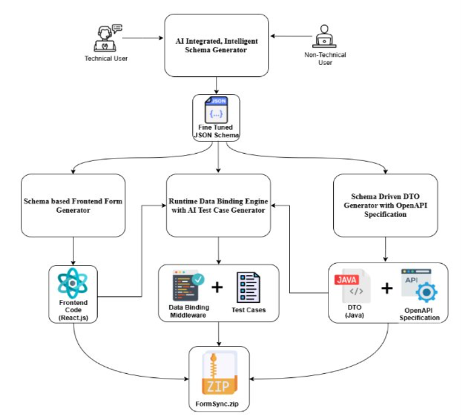

# FormSync

> **AI-Powered Schema Builder & Form Generation Platform**

FormSync is an intelligent, end-to-end solution for creating JSON schemas and generating production-ready forms, APIs, and DTOs with AI-powered enhancement and validation.

[](LICENSE)
[](https://www.typescriptlang.org/)
[](https://reactjs.org/)
[](https://nestjs.com/)

---

## 📋 Table of Contents

- [Overview](#overview)
- [Architecture](#architecture)
- [Components](#components)
- [Features](#features)
- [Tech Stack](#tech-stack)
- [Getting Started](#getting-started)
- [Documentation](#documentation)
- [Project Structure](#project-structure)
- [Contributing](#contributing)
- [License](#license)

---

## 🎯 Overview

FormSync transforms the way developers and non-technical users create and manage JSON schemas. With dual interfaces for both technical and non-technical users, AI-powered schema enhancement, and automatic code generation, FormSync eliminates the complexity of schema creation while ensuring enterprise-grade quality.

### Key Highlights

- 🤖 **AI-Powered**: GPT-4 integration for intelligent schema enhancement and error correction
- 👥 **Dual Interface**: Technical Editor for developers, Template Builder for non-technical users
- 🔄 **Multi-Format Support**: JSON, YAML, and XML input/output
- 🎨 **Drag & Drop**: Intuitive field reordering and template-based schema building
- ⚡ **Real-Time Generation**: Instant React form and backend API code generation
- 🧪 **Test Case Generation**: AI-generated test cases for data validation
- 📊 **Quality Metrics**: Built-in schema quality scoring and validation
- 🔌 **OpenAPI Integration**: Automatic OpenAPI specification generation

---

## 🏗️ Architecture



FormSync consists of four main components working together:

1. **Schema UI** - User interfaces for schema creation
2. **Schema API** - AI-powered backend processing
3. **FormGen Core** - Runtime data binding and validation engine
4. **DTO Generator** - Type-safe DTO and API generation

---

## 🧩 Components

### 1. Schema UI (`apps/schema-ui`)

**Frontend application with dual user interfaces**

#### Technical Editor
Perfect for developers who need full control:
- **Monaco Editor**: Professional code editor with syntax highlighting
- **Multi-Format Input**: Support for JSON, YAML, and XML
- **Schema Tree View**: Visual hierarchy of schema structure
- **Undo/Redo History**: Full history management
- **Upload Support**: Import existing schemas
- **AI Enhancement**: One-click AI-powered schema improvement
- **Live Validation**: Real-time schema validation feedback

#### Template Builder
Designed for non-technical users:
- **Quick Add Fields**: Pre-built field templates (Email, Phone, Date, etc.)
- **9 Schema Templates**: Ready-to-use form templates (Contact Form, Registration, Survey, etc.)
- **Drag & Drop Reordering**: Intuitive field organization
- **Field Validation Editor**: Visual validation rule configuration
- **Live Preview**: Real-time JSON schema preview
- **Modal-Based Editing**: Clean, organized field editing interface

**Tech Stack**: React 18, TypeScript, TailwindCSS, Monaco Editor, Framer Motion, @dnd-kit

---

### 2. Schema API (`apps/schema-api`)

**AI-integrated backend for schema processing**

#### Core Features
- **Format Detection**: Automatic input format recognition
- **Multi-Format Conversion**: Seamless conversion between JSON, YAML, and XML
- **AI Enhancement**: GPT-4 powered schema enrichment with:
  - Intelligent field descriptions
  - Format and pattern suggestions
  - Accessibility metadata
  - Example value generation
- **Validation Engine**: Comprehensive schema validation
- **Error Correction**: AI-assisted error detection and fixing
- **Quality Metrics**: Schema quality scoring based on:
  - Completeness
  - Validation rules coverage
  - Documentation quality
  - Accessibility support

#### AI Integration
- **Provider**: OpenAI GPT-4
- **Capabilities**:
  - Schema enhancement with metadata
  - Error detection and suggestions
  - Quality improvement recommendations
  - Test case generation

**Tech Stack**: NestJS, TypeScript, OpenAI API, JSON Schema Validator, Class Validator

---

### 3. FormGen Core (`packages/formgen-core`)

**Runtime data binding engine with AI test case generation**

#### Features
- **Dynamic Form Generation**: Runtime React form generation from JSON schemas
- **Data Binding Middleware**: Automatic two-way data binding
- **Validation Engine**: Real-time form validation based on schema rules
- **AI Test Case Generation**: Intelligent test case creation for:
  - Edge cases
  - Boundary conditions
  - Invalid input scenarios
  - Valid data examples
- **Custom Components**: Extensible component library
- **Accessibility**: WCAG 2.1 compliant form generation

#### Use Cases
- Dynamic admin panels
- Survey and form builders  
- Configuration UIs
- Data entry applications

**Tech Stack**: React, TypeScript, React Hook Form, Zod, AI Test Generator

---

### 4. DTO Generator (`packages/dto-generator`)

**Schema-driven DTO generator with OpenAPI specification**

#### Features
- **Java DTO Generation**: Type-safe Data Transfer Objects
- **OpenAPI Specification**: Automatic API documentation generation
- **Validation Annotations**: Built-in validation decorators
- **Customizable Templates**: Flexible code generation templates
- **Lombok Integration**: Cleaner, more maintainable DTOs
- **Jackson Annotations**: JSON serialization support

#### Generated Artifacts
```
FormSync.zip
├── frontend/
│   └── ReactForm.jsx          # Generated React form component
├── backend/
│   ├── dto/
│   │   └── *.java            # Java DTOs with validation
│   └── api/
│       └── openapi.yaml      # OpenAPI specification
└── middleware/
    └── DataBinding.js        # Data binding middleware
```

**Tech Stack**: Node.js, TypeScript, Handlebars, OpenAPI Generator

---

## ✨ Features

### For Non-Technical Users
- ✅ Visual template-based schema building
- ✅ Drag & drop field reordering
- ✅ Pre-built form templates
- ✅ No coding required
- ✅ Live preview

### For Developers
- ✅ Multi-format schema editing (JSON/YAML/XML)
- ✅ Professional Monaco editor
- ✅ AI-powered enhancements
- ✅ Code generation
- ✅ OpenAPI integration
- ✅ Test case generation

### AI Capabilities
- 🤖 Intelligent schema enhancement
- 🤖 Error detection and correction
- 🤖 Quality metrics and scoring
- 🤖 Automated test case generation
- 🤖 Field description enrichment

---

## 🛠️ Tech Stack

### Frontend
- **Framework**: React 18 with TypeScript
- **Styling**: TailwindCSS
- **UI Components**: Custom component library with Radix UI
- **Editor**: Monaco Editor
- **State Management**: Zustand
- **Animations**: Framer Motion
- **Drag & Drop**: @dnd-kit
- **HTTP Client**: Axios

### Backend
- **Framework**: NestJS
- **Language**: TypeScript
- **AI Integration**: OpenAI GPT-4 API
- **Validation**: Class Validator, JSON Schema Validator
- **Documentation**: Swagger/OpenAPI

### Build Tools
- **Package Manager**: npm
- **Monorepo**: Turborepo
- **Bundler**: Vite
- **Linting**: ESLint
- **Formatting**: Prettier

---

## 🚀 Getting Started

### Prerequisites
- Node.js 18+ 
- npm 9+
- OpenAI API Key (for AI features)

### Installation

1. **Clone the repository**
   ```bash
   git clone https://github.com/yourusername/formsync.git
   cd formsync
   ```

2. **Install dependencies**
   ```bash
   npm install
   ```

3. **Set up environment variables**
   
   Create `.env` files in:
   - `apps/schema-api/.env`
   ```env
   OPENAI_API_KEY=your_openai_api_key_here
   PORT=3001
   ```
   
   - `apps/schema-ui/.env`
   ```env
   VITE_API_URL=http://localhost:3001
   ```

4. **Run the development servers**
   ```bash
   # Run all services
   npm run dev
   
   # Or run individually:
   # Frontend only
   npm run dev --filter=schema-ui
   
   # Backend only
   npm run dev --filter=schema-api
   ```

5. **Access the application**
   - Frontend: http://localhost:5173
   - Backend API: http://localhost:3001
   - API Documentation: http://localhost:3001/api

### Build for Production

```bash
# Build all packages
npm run build

# Build specific package
npm run build --filter=schema-ui
```

---

## 📚 Documentation

### API Documentation
- **Swagger UI**: Available at `/api` when running the backend
- **Schema Endpoints**:
  - `POST /schema/convert` - Convert between formats
  - `POST /schema/enhance` - AI-powered enhancement
  - `POST /schema/validate` - Validate schema
  - `POST /schema/generate` - Generate code artifacts

### Component Guides

#### Using the Technical Editor
```typescript
import { TechnicalEditor } from './components/TechnicalEditor';

<TechnicalEditor 
  onGenerate={handleGenerate}
  isGenerating={false}
  onStageUpdate={handleStageUpdate}
/>
```

#### Using the Template Builder
```typescript
import { TemplateBuilder } from './components/TemplateBuilder';

<TemplateBuilder 
  onUseSchema={handleSchemaCreated}
/>
```

#### Using FormGen Core
```typescript
import { FormGenerator } from 'formgen-core';

<FormGenerator 
  schema={jsonSchema}
  onSubmit={handleSubmit}
/>
```

---

## 📁 Project Structure

```
formsync/
├── apps/
│   ├── schema-ui/              # Frontend application
│   │   ├── src/
│   │   │   ├── components/     # React components
│   │   │   ├── pages/          # Page components
│   │   │   ├── stores/         # State management
│   │   │   └── api/            # API clients
│   │   └── package.json
│   │
│   └── schema-api/             # Backend API
│       ├── src/
│       │   ├── schema/         # Schema module
│       │   ├── ai/             # AI integration
│       │   └── validation/     # Validation logic
│       └── package.json
│
├── packages/
│   ├── formgen-core/           # Form generation engine
│   │   ├── src/
│   │   │   ├── generator/      # Form generator
│   │   │   ├── binding/        # Data binding
│   │   │   └── validation/     # Runtime validation
│   │   └── package.json
│   │
│   └── dto-generator/          # DTO generation
│       ├── src/
│       │   ├── templates/      # Code templates
│       │   └── generator/      # Generation logic
│       └── package.json
│
├── docs/                       # Documentation
│   └── architecture.png        # System architecture
│
├── turbo.json                  # Turborepo config
├── package.json                # Root package.json
└── README.md                   # This file
```

---

## 🤝 Contributing

We welcome contributions! Please follow these guidelines:

1. Fork the repository
2. Create a feature branch (`git checkout -b feature/amazing-feature`)
3. Commit your changes (`git commit -m 'Add amazing feature'`)
4. Push to the branch (`git push origin feature/amazing-feature`)
5. Open a Pull Request

### Development Guidelines
- Follow TypeScript best practices
- Write meaningful commit messages
- Add tests for new features
- Update documentation as needed
- Ensure all tests pass before submitting PR

---

## 📄 License

This project is licensed under the MIT License - see the [LICENSE](LICENSE) file for details.

---

## 🙏 Acknowledgments

- **OpenAI** for GPT-4 API
- **Monaco Editor** for the code editor
- **NestJS** team for the excellent framework
- **React** team for the UI framework
- All open-source contributors

---

## 📧 Contact

For questions, suggestions, or support:
- **Issues**: [GitHub Issues](https://github.com/yourusername/formsync/issues)
- **Discussions**: [GitHub Discussions](https://github.com/yourusername/formsync/discussions)

---

<div align="center">


⭐ Star this repo if you find it helpful!

</div>
